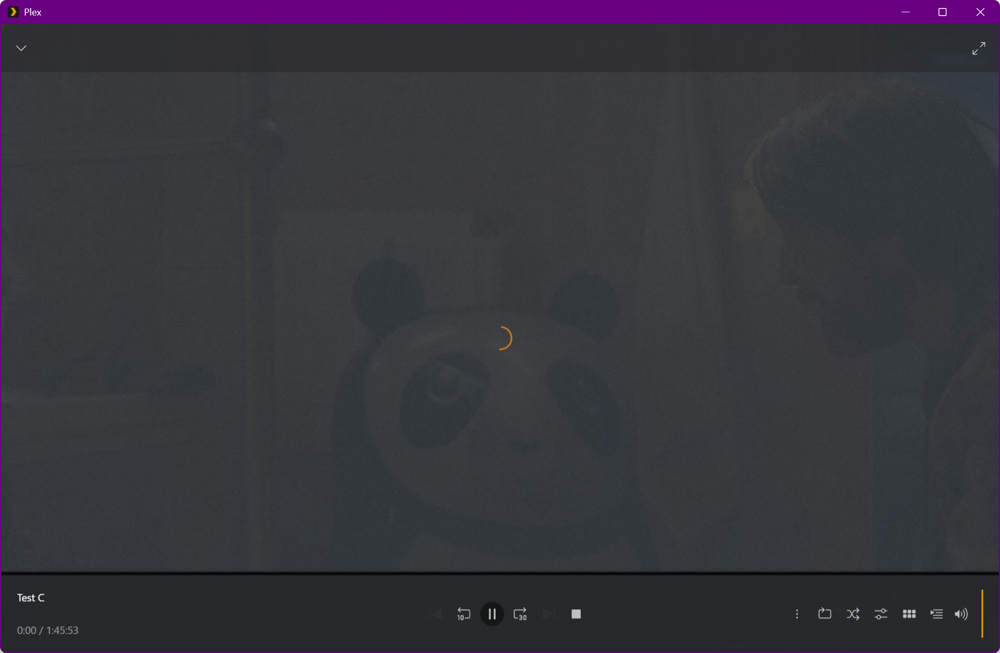
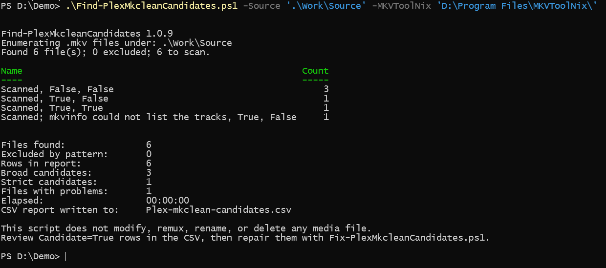
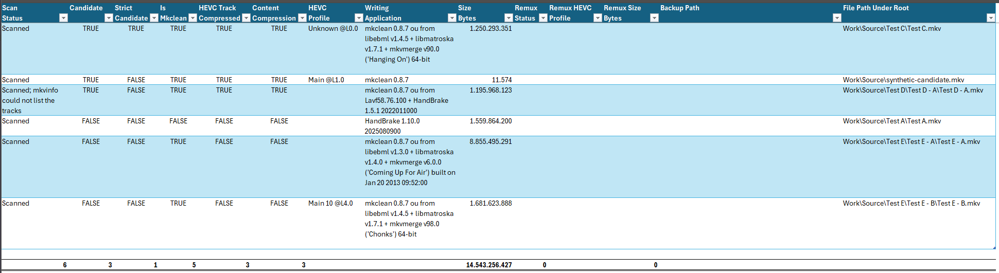
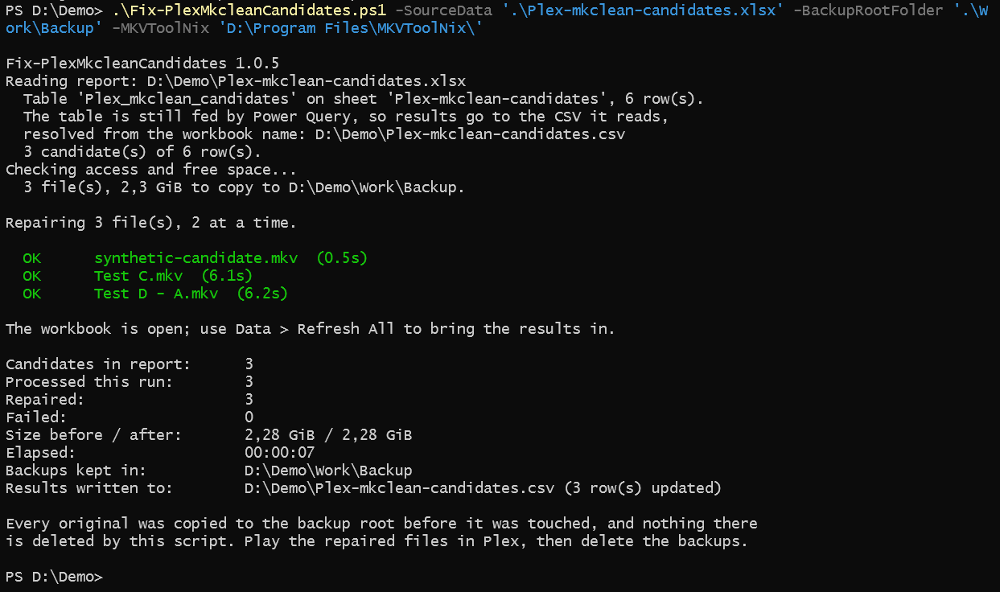
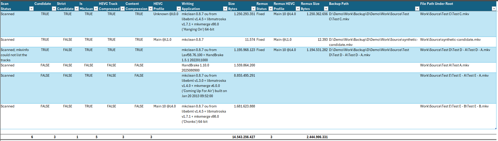
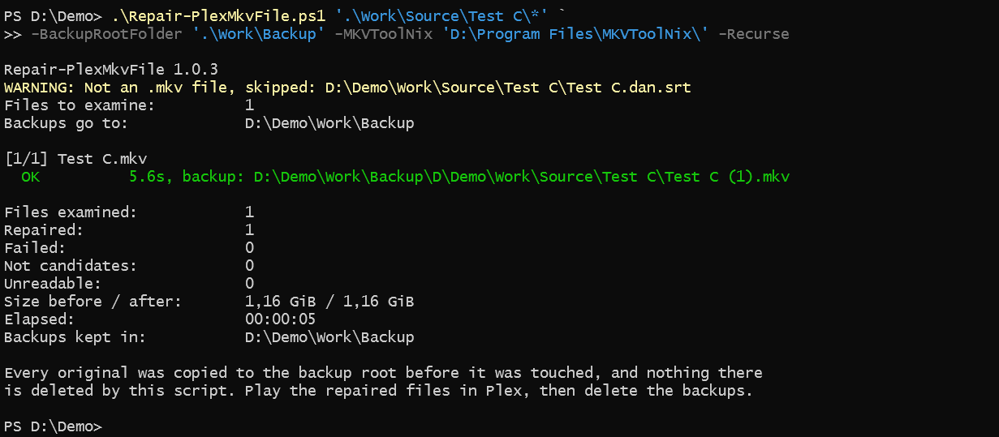

# video-plex-mkclean-repair

Finds and repairs MKV files that the **Plex for Windows app** will not play, because
`mkclean` compressed the CodecPrivate data of their HEVC video track.

Read-only detection first, then a repair that backs up and verifies every original
before it touches it.

## Contents

- [The symptom](#the-symptom)
- [Why it happens](#why-it-happens)
- [What is here](#what-is-here)
- [Requirements](#requirements)
- [Quick start](#quick-start)
- [What it looks like](#what-it-looks-like)
- [How detection works](#how-detection-works)
- [What the repair does, and what it guarantees](#what-the-repair-does-and-what-it-guarantees)
- [Testing a repaired file](#testing-a-repaired-file)
- [Reports](#reports)
- [Folders](#folders)
- [A note on parallelism](#a-note-on-parallelism)
- [Limitations](#limitations)
- [Credits](#credits)
- [License](#license)

## The symptom

A file plays fine in VLC, MPC-HC and mpv, but the Plex for Windows app gets stuck on the 
spinner and never starts playing the video for that one file, when using Direct Play. 
Transcoding to e.g. Plex's own web player works, though.



If that is what you are seeing, and the file is HEVC/H.265 and was at some point run
through `mkclean`, this repository is probably about your problem.

## Why it happens

`mkclean` optimises a Matroska file for streaming. Version 0.8.7 also zlib-compresses
the **CodecPrivate** block of the video track - the few hundred bytes that describe how
to decode the stream. That is legal Matroska: it is ordinary content compression, and a
parser is expected to inflate it before reading.

Not every parser does, though.

* `mkvmerge` inflates it transparently. It reads such a file perfectly, which is exactly
  why it cannot tell you anything is wrong.
* `mkvinfo` does not. It reports the HEVC profile as `Unknown @L0.0`, because it is
  looking at compressed bytes and seeing nonsense.
* The Plex app for Windows, when using Direct Play, behaves like `mkvinfo`. 
  It cannot work out how to decode the track, and hangs.

So the fault is invisible to the one tool that can read the file, and visible to the two
that cannot. That shapes the detection below.

## What is here

| File | What it is |
| --- | --- |
| `Find-PlexMkcleanCandidates.ps1` | Scans a tree and writes a report. Never modifies a media file. |
| `Fix-PlexMkcleanCandidates.ps1` | Repairs every candidate in a report, in parallel, and writes the outcome back into it. |
| `Repair-PlexMkvFile.ps1` | Repairs individual files named on the command line. No report involved. |
| `PlexMkclean.psm1` | The scan and repair engines the other scripts share. |
| `Plex-mkclean-candidates.query.m` | The Power Query M code that builds the Excel view over a report CSV. |

## Requirements

* **PowerShell 7.2 or later.** Windows PowerShell 5.1 will not run these.
* **MKVToolNix** - mkvmerge.exe and mkvinfo.exe. Tested with v101. The scan needs --identification-format json; check yours with mkvmerge --identification-format json --identify <any.mkv>. Both mkvmerge.exe and mkvinfo.exe are used; neither is optional.
* **Microsoft Excel 2016 or later**, (tested with 16.0), and only used for .xlsx reports — the workbook is driven by Power Query, which is built in from 2016. The .csv path needs no Excel at all. and the repair itself never needs it.
* **ffmpeg** - optional, and needed only by `Tests/New-SyntheticCandidate.ps1`. None
  of the other scripts calls it; it builds a disposable file to try them on. See
  [`Tests/README.md`](Tests/README.md).

## Quick start

```powershell
# 1. Scan. Read-only - this cannot damage anything.
.\Find-PlexMkcleanCandidates.ps1 -Source 'Q:\Horror' -ReportFile '.\Work\horror.csv'

# 2. Look at the report. Rows with Candidate=True are the ones that would be changed.

# 3. Rehearsal: prints what would happen and stops there. Nothing is copied,
#    remuxed or written.
.\Fix-PlexMkcleanCandidates.ps1 -SourceData '.\Work\horror.csv' -WhatIf

# 4. The real thing. This is the step that overwrites media files, and the only
#    one that needs -BackupRootFolder.
.\Fix-PlexMkcleanCandidates.ps1 -SourceData '.\Work\horror.csv' `
    -BackupRootFolder 'D:\MkvBackup'
```

For a single file that turns up later, `Repair-PlexMkvFile.ps1` takes paths on the
command line instead of a report:

```powershell
.\Repair-PlexMkvFile.ps1 -LiteralPath 'Q:\Horror\Some Film (2023)\film.mkv' `
    -BackupRootFolder 'D:\MkvBackup'
```

To try the tools without going near your own library, scan the disposable file that
comes with this repository:

```powershell
.\Find-PlexMkcleanCandidates.ps1 -Source .\Tests -ReportFile .\Work\try-it.csv
```

`Tests/synthetic-candidate.mkv` is 11 KB and reports `Candidate=True`. `Work` is the
scratch folder, and its contents are not in version control, so a report written there
leaves the repository clean. See [`Tests/README.md`](Tests/README.md) for what the file
does and does not stand in for.

Every script has full comment-based help: `Get-Help .\Find-PlexMkcleanCandidates.ps1 -Full`.

## What it looks like

A whole pass over a small test library: six `.mkv` files, seven subtitles and two
`.mp4`, arranged the way a Plex library usually is. `Backup` starts out empty.

```text
D:\DEMO
|   Find-PlexMkcleanCandidates.ps1
|   Fix-PlexMkcleanCandidates.ps1
|   Plex-mkclean-candidates.csv
|   Plex-mkclean-candidates.xlsx
|   PlexMkclean.psm1
|   Repair-PlexMkvFile.ps1
|
\---Work
    +---Backup
    \---Source
        |   synthetic-candidate.mkv
        |
        +---Test A
        |       Test A.da.srt
        |       Test A.mkv
        |
        +---Test B
        |       Test B.da.srt
        |       Test B.mp4
        |
        +---Test C
        |       Test C.dan.srt
        |       Test C.mkv
        |
        +---Test D
        |   +---Test D - A
        |   |       Test D - A.mkv
        |   |
        |   \---Test D - B
        |           Test D - B.da.srt
        |           Test D - B.mp4
        |
        \---Test E
            +---Test E - A
            |       Test E - A.dan.srt
            |       Test E - A.eng.srt
            |       Test E - A.mkv
            |
            \---Test E - B
                    Test E - B.dan.srt
                    Test E - B.eng.srt
                    Test E - B.mkv
```

### 1. Scan



<details>
<summary>The same output as text</summary>

```text
PS D:\Demo> .\Find-PlexMkcleanCandidates.ps1 -Source '.\Work\Source' -MKVToolNix 'D:\Program Files\MKVToolNix\'

Find-PlexMkcleanCandidates 1.0.9
Enumerating .mkv files under: .\Work\Source
Found 6 file(s); 0 excluded; 6 to scan.

Name                                                    Count
----                                                    -----
Scanned, False, False                                       3
Scanned, True, False                                        1
Scanned, True, True                                         1
Scanned; mkvinfo could not list the tracks, True, False     1


Files found:               6
Excluded by pattern:       0
Rows in report:            6
Broad candidates:          3
Strict candidates:         1
Files with problems:       1
Elapsed:                   00:00:00
CSV report written to:     Plex-mkclean-candidates.csv

This script does not modify, remux, rename, or delete any media file.
Review Candidate=True rows in the CSV, then repair them with Fix-PlexMkcleanCandidates.ps1.

PS D:\Demo>
```

</details>

<br>

The grouped table counts `ScanStatus`, `Candidate` and `StrictCandidate` together, so
the shape of a library is visible before the report is opened. Three of the six files
are candidates, and one of those is strict - `mkvinfo` cannot read its HEVC profile at
all. The fourth line is the file whose tracks `mkvinfo` could not list, which is a
symptom of the fault rather than a reason to skip the file.

The two `.mp4` files and every subtitle were never enumerated, and nothing was modified.

### 2. The report



The workbook is a Power Query view over the CSV. `Remux Status`, `Remux HEVC Profile`,
`Remux Size Bytes` and `Backup Path` are created empty by the scan and filled in by the
repair - which is what makes them survive a re-scan. Columns that matter for analysis
but not for reading this are hidden: the exit codes, `Root`, `Size GiB` and the
timestamps.

### 3. Repair every candidate in the report



<details>
<summary>The same output as text</summary>

```text
PS D:\Demo> .\Fix-PlexMkcleanCandidates.ps1 -SourceData '.\Plex-mkclean-candidates.xlsx' -BackupRootFolder '.\Work\Backup' -MKVToolNix 'D:\Program Files\MKVToolNix\'

Fix-PlexMkcleanCandidates 1.0.5
Reading report: D:\Demo\Plex-mkclean-candidates.xlsx
  Table 'Plex_mkclean_candidates' on sheet 'Plex-mkclean-candidates', 6 row(s).
  The table is still fed by Power Query, so results go to the CSV it reads,
  resolved from the workbook name: D:\Demo\Plex-mkclean-candidates.csv
  3 candidate(s) of 6 row(s).
Checking access and free space...
  3 file(s), 2,3 GiB to copy to D:\Demo\Work\Backup.

Repairing 3 file(s), 2 at a time.

  OK      synthetic-candidate.mkv  (0.5s)
  OK      Test C.mkv  (6.1s)
  OK      Test D - A.mkv  (6.2s)

The workbook is open; use Data > Refresh All to bring the results in.

Candidates in report:      3
Processed this run:        3
Repaired:                  3
Failed:                    0
Size before / after:       2,28 GiB / 2,28 GiB
Elapsed:                   00:00:07
Backups kept in:           D:\Demo\Work\Backup
Results written to:        D:\Demo\Plex-mkclean-candidates.csv (3 row(s) updated)

Every original was copied to the backup root before it was touched, and nothing there
is deleted by this script. Play the repaired files in Plex, then delete the backups.

PS D:\Demo>
```

</details>

<br>

`Fix` found the workbook still fed by Power Query, so it wrote its results to the CSV
the query reads rather than into the table, where the next refresh would have discarded
them. Three candidates out of six rows, two at a time.

> Numbers in these summaries follow the machine's own format. This run was on a Danish
> Windows, where the decimal separator is a comma - and the thousands separator is a dot.

Only `Backup` changed. The original of each repaired file is there, under a mirror of
its own path:

```text
\---Work
    +---Backup
    |   \---D
    |       \---Demo
    |           \---Work
    |               \---Source
    |                   |   synthetic-candidate.mkv
    |                   |
    |                   +---Test C
    |                   |       Test C.mkv
    |                   |
    |                   \---Test D
    |                       \---Test D - A
    |                               Test D - A.mkv
```

### 4. The report afterwards



The row to read is the strict candidate. `HEVC Profile` was `Unknown @L0.0`; its
`Remux HEVC Profile` is `Main 10 @L4.0`. The profile can be read again - which is the
fault being gone, not merely a file having been rewritten.

`Remux Size Bytes` lands within a fraction of a percent of `Size Bytes` either way: two
of the three grew slightly, one shrank. No stream is re-encoded.

> The totals row counts different things on each side: `Size Bytes` sums all six files,
> `Remux Size Bytes` only the three that were repaired.

### 5. A single file, later



<details>
<summary>The same output as text</summary>

```text
PS D:\Demo> .\Repair-PlexMkvFile.ps1 '.\Work\Source\Test C\*' `
>> -BackupRootFolder '.\Work\Backup' -MKVToolNix 'D:\Program Files\MKVToolNix\' -Recurse

Repair-PlexMkvFile 1.0.3
WARNING: Not an .mkv file, skipped: D:\Demo\Work\Source\Test C\Test C.dan.srt
Files to examine:          1
Backups go to:             D:\Demo\Work\Backup

[1/1] Test C.mkv
  OK          5.6s, backup: D:\Demo\Work\Backup\D\Demo\Work\Source\Test C\Test C (1).mkv

Files examined:            1
Repaired:                  1
Failed:                    0
Not candidates:            0
Unreadable:                0
Size before / after:       1,16 GiB / 1,16 GiB
Elapsed:                   00:00:05
Backups kept in:           D:\Demo\Work\Backup

Every original was copied to the backup root before it was touched, and nothing there
is deleted by this script. Play the repaired files in Plex, then delete the backups.

PS D:\Demo>
```

</details>

<br>

`Test C.mkv` was put back and repaired on its own. Two things worth seeing there: the
subtitle beside it was skipped with a warning rather than treated as an error, and the
backup did not overwrite the one already in place.

```text
    |                   +---Test C
    |                   |       Test C (1).mkv
    |                   |       Test C.mkv
```

Nothing else under `Backup` changed.

Running a repair against a file that is already sound says so rather than doing the work
twice:

```text
[1/1] Test C.mkv
  NOT NEEDED  no compressed HEVC track; Plex should play it. -Force remuxes it anyway.
```

That line is the scan's verdict on the repaired file, and it is the quickest way to
confirm a repair worked without opening a report.

## How detection works

Two passes per file, both read-only.

**Pass 1 - `mkvmerge -J`.** JSON identification gives the container's writing application
and, per track, the codec ID and the content encoding algorithms. Because it is per
track, "is HEVC" and "is compressed" can be tied to the *same* track - which a flat text
search over the file cannot do.

    Candidate = written by mkclean
              + has an HEVC video track
              + that track carries content compression

**Pass 2 - `mkvinfo`**, run only on files that are already mkclean + HEVC. If it reads
the profile of that track as `Unknown`, the file is also a `StrictCandidate`.

A candidate that is not strict is **not** a weaker hit. It usually means `mkvinfo` could
not list the tracks at all, which is itself a symptom. Candidacy is decided from
`mkvmerge` alone for exactly that reason.

## What the repair does, and what it guarantees

Five steps, and no step is allowed to destroy the evidence of the one before it:

1. **Back up.** The original is copied to a mirror of its own path under the backup root:
   `Q:\Horror\Film\x.mkv` becomes `<backup root>\Q\Horror\Film\x.mkv`. An existing backup
   is never overwritten - a colliding name gets ` (1)`, ` (2)` and so on.
2. **Verify the copy.** Size and last-write time, or a full SHA-256 of both sides with
   `-VerifyHash`. A failure here stops that file dead, because the backup is the only
   safety net that exists once step 5 runs.
3. **Remux the backup** - never the original - into a temporary file beside the original:

       mkvmerge --ui-language en --compression -1:none -o <original>.remux.tmp <backup>

   `--compression -1:none` applies to every track, which makes it impossible for the
   output to repeat the exact fault being repaired.
4. **Verify the result** before it replaces anything: the HEVC track must have lost its
   content compression, `mkvinfo` must be able to read the profile again, and the track
   count and duration must still match the backup.
5. **Swap**, and restore the original timestamps so the Plex library's sort order and
   "date added" do not jump for a file whose content has not changed.

Nothing under the backup root is ever deleted by these scripts. Delete the backups
yourself once you have verified that Plex can play the repaired files.

The remux is lossless. No stream is re-encoded; only the container is rewritten.

## Testing a repaired file

**Restart the Plex app between playback tests - and closing the window is not a
restart.** When the spinning symptom happens, the app process keeps running after its window is gone, 
so the poisoned session survives. End the process itself:

```powershell
Get-Process Plex* | Stop-Process
```

or Task Manager > End task. Only then start the app again.

This matters because one file that hangs poisons the app session: afterwards a perfectly
good file hangs too. Test a repair without ending the process first and the app will
tell you the repair failed when it did not.

## Reports

A report is a CSV. The Excel workbook beside it is a *view* that Power Query builds over
that CSV - which is why `Plex-mkclean-candidates.query.m` is in this repository.

The path is split into two columns, `Root` (drive plus first folder, e.g. `Q:\Horror`)
and `FileName` (everything below it), so a report can be filtered and grouped by the source folder,
e.g. a genre folder.

Five columns - `RemuxStatus`, `RemuxTime`, `RemuxHevcProfile`, `RemuxSizeBytes`,
`BackupPath` - are written empty by the scan and filled in by the repair. They are
created by the scan rather than added later because a column that exists from the first
scan is part of the query's own output and survives every refresh, whereas one added to
the workbook by hand is positional and drifts out of alignment as soon as a re-scan
changes the row order.

Both scripts append results to a `.partial` file as they go, so an interrupted or
crashed run loses nothing and continues with `-Resume`. A run that finds one waiting
asks what to do with it - resume it, discard it, or stop - rather than deciding for
you; and a report that cannot be written, which in practice means Excel has it open,
becomes a question rather than a silent second copy.

Nobody is there to answer those questions in a scheduled run, so pass
`-NonInteractive`. Each one then answers itself with the option that destroys nothing,
and writes both the question and the answer it took to the log:

```powershell
pwsh -NoProfile -NonInteractive -File .\Find-PlexMkcleanCandidates.ps1 `
     -Source 'Q:\Horror' -ReportFile '.\Prod\Plex-mkclean-candidates - Horror.csv' *> scan.log
```

```text
WARNING: ...Horror.csv.partial holds the results of a scan that did not finish. What should happen to it?
WARNING: There is no console to answer this, so 'Cancel' is assumed.
Stopped. ...Horror.csv.partial is untouched - run again with -Resume to continue it.
```

Add `-Resume` to that command line and it continues the scan instead of stopping.

## Folders

| Folder | Contents |
| --- | --- |
| `Work/` | Scratch space for trial runs. Overwriting anything here is meaningless. |
| `Prod/` | Reports from production runs against real data - a log of what has actually been run. |
| `Tests/` | Checks on the scripts themselves, and a builder for a disposable test file. |

`Work/` and `Prod/` are tracked as folders but their contents are ignored, so your
library never ends up in git. `Tests/` is ordinary source and is tracked in full.

## A note on parallelism

`Find` defaults to `-ThrottleLimit 8`, because scanning is cheap. `Fix` defaults to
**2**, deliberately.

If source and backup live on the same NAS, one 1 GiB file costs roughly 2 GiB of traffic
for the copy, 2 GiB more for `-VerifyHash`, and 2 GiB more for the remux - all over one
link. Beyond two or three files at a time the link is saturated, and further parallelism
buys nothing while making every individual file slower.

## Limitations

* Windows only. The scripts use Windows path shapes, Excel COM automation and Windows
  process priority classes.
* The detection targets one specific fault: content compression on an HEVC track in a
  file written by `mkclean`. It is not a general "why will Plex not play this" tool.
* `Tests/` checks invariants of the source - that every file parses, that the help is
  intact, that no default points at one particular machine, and that the three scripts
  survive their earliest exits. It is not a regression suite: nothing in it asserts on
  the content of a repaired file. Behaviour is verified by running the tools against
  real files and reading the report.
* A NAS share with a recycle bin will run out of space on a long repair run. The delete
  in step 5 does not free anything - the original is kept in the recycle bin - so the
  volume has to hold the whole source folder tree of files (e.g. genre) a second time. 
  `Fix` warns about this; on an ordinary drive the warning is harmless.

## Credits

Written by Bent Hardolf Jørgensen, who diagnosed the fault, specified the tools and
tested every version of them against a real library.

The code was largely drafted by [Claude](https://claude.com/claude-code) (Anthropic)
working to that specification - the detection logic, the repair engine and this README
included. Every design decision, every correction and all verification are the author's.

## License

MIT. See [LICENSE](LICENSE).

Copyright is the author's alone. A model is a tool, not a rights holder, so the credit
above is acknowledgement rather than joint authorship in the legal sense.
